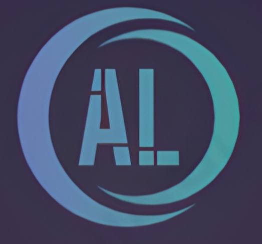
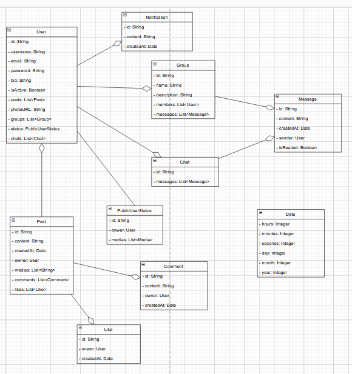
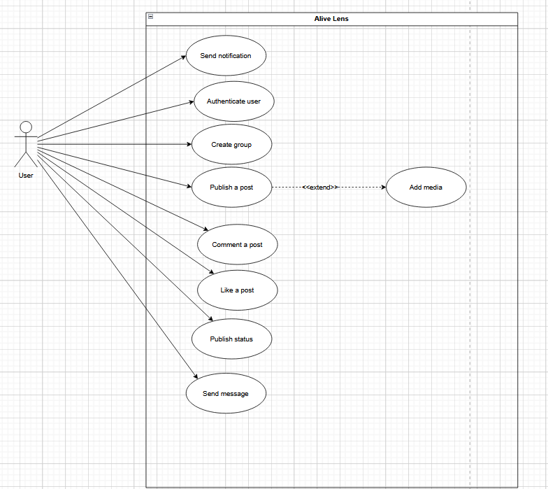
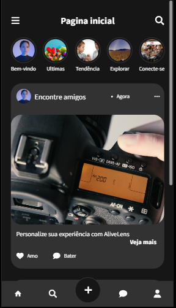
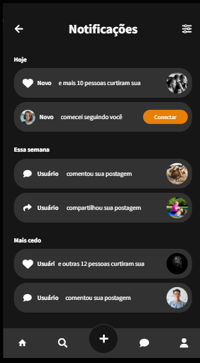

# Alive Lens (O melhor dos dois mundos)

É um app que tem como principal objetivo juntar o que tem de melhor
no whatsapp e instagram.

## Diagrama de Classes

## Diagrama de casos de uso

## Telas

### Tela inicial

### Tela de notificações

## Contribuidores

- Victor Henrique: https://github.com/VictorHenrique111007
- Gabriel Lampert do Amaral: https://github.com/gabriellampert
